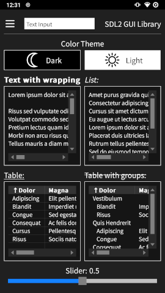
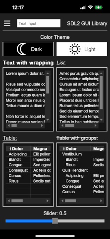
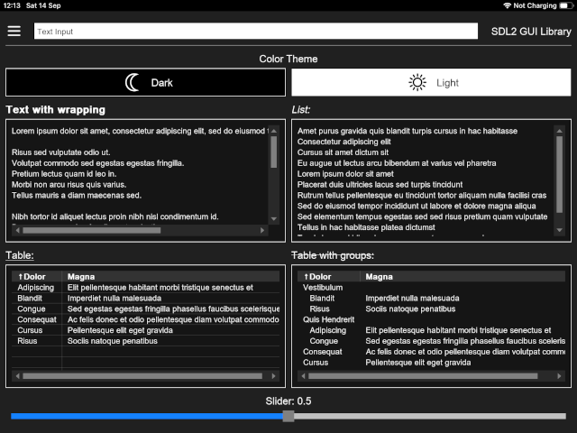
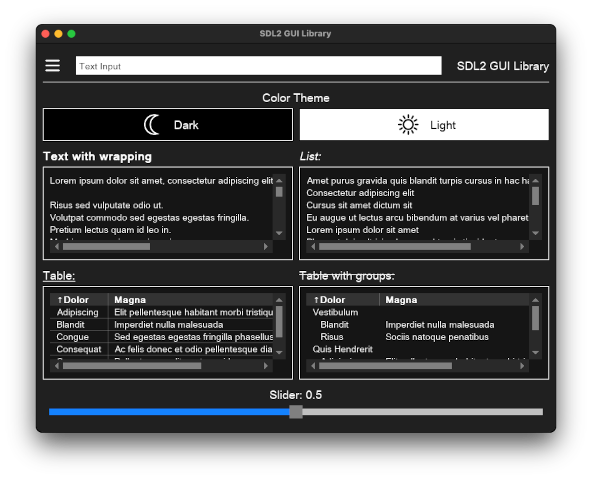
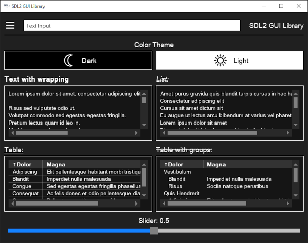

# libsdl2gui

## A free cross-platform user interface library using SDL2

Copyright (C) 2021 Adam A. Jammary (Jammary Studio)

libsdl2gui is a free cross-platform user interface library using SDL2.

## 3rd Party Libraries

Library | Version | License
------- | ------- | -------
[SDL2](https://www.libsdl.org/) | [2.28.5](https://www.libsdl.org/release/SDL2-2.28.5.tar.gz) | [zlib license](https://www.libsdl.org/license.php)
[SDL2_image](https://github.com/libsdl-org/SDL_image) | [2.6.3](https://www.libsdl.org/projects/SDL_image/release/SDL2_image-2.6.3.tar.gz) | [zlib license](https://www.libsdl.org/license.php)
[SDL2_ttf](https://github.com/libsdl-org/SDL_ttf) | [2.20.2](https://www.libsdl.org/projects/SDL_ttf/release/SDL2_ttf-2.20.2.tar.gz) | [zlib license](https://www.libsdl.org/license.php)
[libXML2](https://github.com/GNOME/libxml2) | [2.11.5](https://github.com/GNOME/libxml2/archive/refs/tags/v2.11.5.tar.gz) | [MIT License](https://opensource.org/licenses/mit-license.html)

## Platform-dependent Include Headers

Platform | Header | Package
-------- | ------ | -------
Android | android/asset_manager_jni.h | Android NDK
Android | sys/stat.h | Android NDK
iOS | UIKit/UIKit.h | UIKit Framework
Linux | gtk/gtk.h | libgtk-3-dev
macOS | AppKit/AppKit.h | AppKit Framework
Windows | shobjidl_core.h | Win32 API

## Compilers and C++20

libsdlgui uses modern [C++20](https://en.cppreference.com/w/cpp/compiler_support#cpp20) features and requires the following minimum compiler versions.

Compiler | Version
-------- | -------
CLANG | 14
GCC | 13
MSVC | 2019

## How to build

1. Build the third-party libraries and place the them in a common directory.
1. Make sure you have [cmake](https://cmake.org/download/) installed.
1. Open a command prompt or terminal.
1. Create a **build** directory and enter it.
1. Run `cmake` to create a **Makefile**, **Xcode** project or **Visual Studio** solution based on your target platform.
1. After building, the **dist** directory will contain all the output resources in the **include**, **lib** and **bin** directories.

```bash
mkdir build
cd build
```

### Android

Make sure you have [Android SDK](https://developer.android.com/studio) and [Android NDK](https://developer.android.com/ndk/downloads) installed.

Make sure the correct Android SDK path is set as either

- an environment variable `ANDROID_HOME=/path/to/ANDROID_SDK` or
- a local property `sdk.dir=/path/to/ANDROID_SDK` in the **android/local.properties** file

> See [Android SDK Command-Line Tools](https://developer.android.com/tools) and [SDL2 Android README](https://wiki.libsdl.org/SDL2/README/android) for more details.

```bash
cmake .. -G "Unix Makefiles" \
-D CMAKE_SYSTEM_NAME="Android" \
-D CMAKE_TOOLCHAIN_FILE="/path/to/ANDROID_NDK/build/cmake/android.toolchain.cmake" \
-D ANDROID_NDK="/path/to/ANDROID_NDK" \
-D ANDROID_ABI="arm64-v8a" \
-D ANDROID_PLATFORM="android-26" \
-D EXT_LIB_DIR="/path/to/libs"

make
```

#### ADB (Android Debug Bridge)

> See [ADB (Android Debug Bridge)](https://developer.android.com/tools/adb) for more details.

##### Install APK to device

```bash
/path/to/ANDROID_SDK/platform-tools/adb install dist/bin/testsdl2gui-debug.apk
```

##### Re-install (update) APK to device

```bash
/path/to/ANDROID_SDK/platform-tools/adb install -r dist/bin/testsdl2gui-debug.apk
```

##### Uninstall (remove) APK from device

```bash
/path/to/ANDROID_SDK/platform-tools/adb uninstall com.libsdl2gui.test
```



### iOS

You can get the iOS SDK path with the following command: `xcrun --sdk iphoneos --show-sdk-path`

> See [SDL2 iOS README](https://wiki.libsdl.org/SDL2/README/ios) for more details.

```bash
/Applications/CMake.app/Contents/bin/cmake .. -G "Xcode" \
-D CMAKE_SYSTEM_NAME="iOS" \
-D CMAKE_OSX_ARCHITECTURES="arm64" \
-D CMAKE_OSX_DEPLOYMENT_TARGET="12.5" \
-D CMAKE_OSX_SYSROOT="/path/to/IOS_SDK" \
-D CMAKE_XCODE_ATTRIBUTE_DEVELOPMENT_TEAM="YOUR_DEVELOPMENT_TEAM_ID" \
-D EXT_LIB_DIR="/path/to/libs"

xcodebuild IPHONEOS_DEPLOYMENT_TARGET="12.5" -project sdl2gui.xcodeproj -configuration Release -destination "generic/platform=iOS"
```

#### Xcode - Devices and Simulators

> See [Xcode - Running your app in Simulator or on a device](https://developer.apple.com/documentation/xcode/running-your-app-in-simulator-or-on-a-device) for more details.

#### Install APP on device or simulator

1. Connect the device to your Mac (optional if installing on a simulator).
1. Open **Xcode**.
1. Select `Window > Devices and Simulators` from the main menu.
1. Select the device or simulator from the list on the left.
1. Click the `+` icon under **Installed Apps**.
1. Locate and select `dist/bin/testsdl2gui.app`.

The app should now be installed on the device or simulator with the name **testsdl2gui**.

> If the installation fails, most likely it means the app package was not signed correctly. Try opening `sdl2gui.xcodeproj` in Xcode to make sure all signing options have been set correctly.




### macOS

You can get the macOS SDK path with the following command: `xcrun --sdk macosx --show-sdk-path`

```bash
/Applications/CMake.app/Contents/bin/cmake .. -G "Xcode" \
-D CMAKE_OSX_ARCHITECTURES="x86_64" \
-D CMAKE_OSX_DEPLOYMENT_TARGET="12.6" \
-D CMAKE_OSX_SYSROOT="/path/to/MACOSX_SDK" \
-D EXT_LIB_DIR="/path/to/libs"

xcodebuild MACOSX_DEPLOYMENT_TARGET="12.6" -project sdl2gui.xcodeproj -configuration Release
```



### Linux

```bash
cmake .. -G "Unix Makefiles" -D EXT_LIB_DIR="/path/to/libs"

make
```


### Windows

```bash
cmake .. -G "Visual Studio 17 2022" -D EXT_LIB_DIR="/path/to/libs"

devenv.com sdl2gui.sln -build "Release|x64"
```



## Test project

You must call [LSG_Start](#lsg_start) before using other *LSG_\** methods, see the *test* project for examples.

```cpp
try {
  SDL_Renderer* renderer = LSG_Start("ui/main.xml");

  while (LSG_IsRunning()) {
    std::vector<SDL_Event> events = LSG_Run();

    myapp_handleEvents(events);
    myapp_render(renderer);

    if (LSG_IsRunning())
      LSG_Present();

    SDL_Delay(50);
  }

  LSG_Quit();
} catch (const std::exception &e) {
  LSG_ShowError(e.what());
  LSG_Quit();
}
```

## Start

The first step is to run [LSG_Start](#lsg_start) which

- creates a new [SDL_Window](https://wiki.libsdl.org/SDL2/SDL_CreateWindow)
- loads UI components from the XML file
- creates and returns an [SDL_Renderer](https://wiki.libsdl.org/SDL2/SDL_CreateRenderer)

```cpp
SDL_Renderer* renderer = LSG_Start("ui/main.xml");
```

## Handle Events

You can call [LSG_IsRunning](#lsg_isrunning) to make sure the library was initialized successfully and is available for *LSG_\** calls.

[LSG_Run](#lsg_run)

- Clears the render buffer
- Renders UI components (if XML file was loaded)
- Handles UI related events (like clicking, scrolling, sliding etc.)
- Returns a list of all [SDL Events](https://wiki.libsdl.org/SDL2/SDL_Event) available
  - including the ones already handled by the library
  - custom library events will be available as [SDL_UserEvent](https://wiki.libsdl.org/SDL2/SDL_UserEvent)

```cpp
void myapp_handleEvents(const std::vector<SDL_Event>& events)
{
  for (const SDL_Event& event : events) {
    if ((event.type == SDL_WINDOWEVENT) && (event.window.event == SDL_WINDOWEVENT_CLOSE))
      LSG_Quit();
    else if (event.type >= SDL_USEREVENT)
      myapp_handleUserEvent(event.user);
    else if (event.type == SDL_KEYUP)
      myapp_handleKeyEvent(event.key);
  }
}
```

[SDL_UserEvent](https://wiki.libsdl.org/SDL2/SDL_UserEvent)

- The `.code` property will contain the [LSG_EventType](#lsg_eventtype)
- The `.data1` property will contain the `id` XML-attribute of the UI component that triggered the event
- The `.data2` property may contain extra data, and depends on the type of UI component

```cpp
void myapp_handleUserEvent(const SDL_UserEvent& event)
{
  LSG_EventType type = (LSG_EventType)event.code;
  const char*   id   = static_cast<const char*>(event.data1);

  if ((type == LSG_EVENT_ROW_ACTIVATED) || (type == LSG_EVENT_ROW_SELECTED) || (type == LSG_EVENT_ROW_UNSELECTED))
    int rowIndex = *static_cast<int*>(event.data2); // 0-based row index (-1 for unselected)
  else if (type == LSG_EVENT_SLIDER_VALUE_CHANGED)
    double sliderValue = *static_cast<double*>(event.data2); // Percent-based slider value: [0.0, 1.0]
}
```

## Custom Render

You can also perform custom rendering like [SDL_RenderFillRect](https://wiki.libsdl.org/SDL2/SDL_RenderFillRect) by using the [SDL_Renderer](https://wiki.libsdl.org/SDL2/SDL_CreateRenderer) returned from [LSG_Start](#lsg_start).

> Make sure to render after calling [LSG_Run](#lsg_run) as it will clear anything in the render buffer.

```cpp
void myapp_render(SDL_Renderer* renderer)
{
    SDL_Size windowSize  = LSG_GetWindowSize();
    SDL_Rect destination = { ((windowSize.width - 100) / 2), ((windowSize.height - 100) / 2), 100, 100 };

    SDL_SetRenderDrawBlendMode(renderer, SDL_BLENDMODE_BLEND);
    SDL_SetRenderDrawColor(renderer, 255, 0, 0, 64);
    SDL_RenderFillRect(renderer, &destination);
}
```

## Present

Finally, you can run [LSG_Present](#lsg_present) to swap the background buffer and [present](https://wiki.libsdl.org/SDL2/SDL_RenderPresent) it to the screen.

## Quit

Make sure to call [LSG_Quit](#lsg_quit) to cleanup all resources and close the library.

## XML UI components

### \<button\>

[alignment](#alignment) | [boolean](#boolean) | [color](#color) | [orientation](#orientation) | [size](#size)

Triggers [LSG_EVENT_BUTTON_CLICKED](#handle-events) event.

```ini
id="string"
enabled="boolean"
width="size"
height="size"
orientation="orientation"
background-color="color"
border="int"
border-color="color"
margin="int"
padding="int"
halign="alignment_horizontal"
valign="alignment_vertical"
spacing="int"
font-size="int" # default="14"
text-color="color"
```

### \<image\>

[alignment](#alignment) | [boolean](#boolean) | [color](#color) | [file_path](#file_path) | [size](#size)

```ini
id="string"
width="size"
height="size"
background-color="color"
border="int"
border-color="color"
halign="alignment_horizontal"
valign="alignment_vertical"

file="file_path"
fill="boolean"
```

### \<line\>

[color](#color) | [orientation](#orientation) | [size](#size)

```ini
id="string"
width="size"
height="size"
orientation="orientation"

color="color"
```

### \<list\>

[alignment](#alignment) | [boolean](#boolean) | [color](#color) | [size](#size) | [sort_order](#sort_order)

Triggers [LSG_EVENT_ROW_ACTIVATED](#handle-events), [LSG_EVENT_ROW_SELECTED](#handle-events) and [LSG_EVENT_ROW_UNSELECTED](#handle-events) events.

```ini
id="string"
enabled="boolean"
width="size"
height="size"
background-color="color"
border="int"
border-color="color"
row-border="boolean"
halign="alignment_horizontal"
valign="alignment_vertical"
font-size="int" # default="14"
text-color="color"

sort="sort_order"
```

### \<menu\>

[alignment](#alignment) | [boolean](#boolean) | [color](#color) | [size](#size)

Triggers [LSG_EVENT_MENU_SELECTED](#handle-events) event.

```ini
id="string"
enabled="boolean"
width="size"
height="size"
background-color="color"
border="int"
border-color="color"
margin="int"
halign="alignment_horizontal"
valign="alignment_vertical"
font-size="int" # default="14"
text-color="color"
```

### \<panel\>

[alignment](#alignment) | [color](#color) | [orientation](#orientation) | [size](#size)

Triggers [LSG_EVENT_COMPONENT_CLICKED](#handle-events) and [LSG_EVENT_COMPONENT_DOUBLE_CLICKED](#handle-events) and [LSG_EVENT_COMPONENT_RIGHT_CLICKED](#handle-events) events.

```ini
id="string"
width="size"
height="size"
orientation="orientation"
background-color="color"
border="int"
border-color="color"
margin="int"
padding="int"
halign="alignment_horizontal"
valign="alignment_vertical"
spacing="int"
font-size="int" # default="14"
text-color="color"
```

### \<slider\>

[boolean](#boolean) | [color](#color) | [orientation](#orientation) | [percent](#percent) | [size](#size)

Triggers [LSG_EVENT_SLIDER_VALUE_CHANGED](#handle-events) event.

```ini
id="string"
enabled="boolean"
width="size" # minimum="20" (vertical)
height="size" # minimum="20" (horizontal)
orientation="orientation"
background-color="color"
border="int"
border-color="color"
margin="int"
padding="int"

value="percent"
fill-progress="boolean"
progress-color="color"
thumb-color="color"
thumb-width="int" # minimum="10"
thumb-border-color="color"
thumb-border="int"
```

### \<table\>

[alignment](#alignment) | [boolean](#boolean) | [color](#color) | [size](#size) | [sort_order](#sort_order)

Triggers [LSG_EVENT_ROW_ACTIVATED](#handle-events), [LSG_EVENT_ROW_SELECTED](#handle-events) and [LSG_EVENT_ROW_UNSELECTED](#handle-events) events.

```ini
id="string"
enabled="boolean"
width="size"
height="size"
background-color="color"
border="int"
border-color="color"
row-border="boolean"
halign="alignment_horizontal"
valign="alignment_vertical"
font-size="int" # default="14"
text-color="color"

sort="sort_order"
sort-column="int" # 0-based index
```

### \<text\>

[alignment](#alignment) | [boolean](#boolean) | [color](#color) | [size](#size)

```ini
id="string"
width="size"
height="size"
background-color="color"
border="int"
border-color="color"
halign="alignment_horizontal"
valign="alignment_vertical"
font-size="int" # default="14"
text-color="color"

bold="boolean"
italic="boolean"
strike-through="boolean"
underline="boolean"
wrap="boolean"
```

### \<window\>

[boolean](#boolean) | [file_path](#file_path)

```ini
title="string"
width="int"
height="int"
min-width="int" # default="400"
min-height="int" # default="400"
x="int"
y="int"
maximized="boolean"
color-theme-file="file_path"
```

## XML UI component attributes

### alignment

```ini
value="left|center|right" # Horizontal default="left"
value="top|middle|bottom" # Vertical default="top"
```

### boolean

```ini
value="true|false" # default="false"
```

### color

```ini
value="#00FF00|#00FF0080" # Hex default="#00000000"
value="rgb(0,255,255)|rgba(0,255,0,0.5)" # RGB default="rgba(0,0,0,0)"
```

### file_path

```ini
value="/path/to/ui/dark.colortheme|C:/path/to/ui/dark.colortheme" # Absolute
value="ui/dark.colortheme" # Relative
```

### orientation

```ini
value="horizontal|vertical" # default="horizontal"
```

### percent

```ini
value="0.5" # 50% [0.0,1.0] default="0.0"
```

### size

```ini
value="100" # Absolute
value="10%" # Relative
```

### sort_order

```ini
value="ascending|descending" # default="ascending"
```

## Color Theme File

```ini
<id>.background-color=<color>
<id>.border-color=<color>
<id>.text-color=<color>
```

- `<id>` needs to correspond to the XML-attribute `id` of the UI component.
- `<color>` can have the same values as [color](#color) (without the string quotes).
  - Unlike XML, the `.colortheme` file does not wrap the values in string quotes, so `"#000000"` becomes `#000000`.
- `<id>` and `*-color` attribute are seperated by a `.` (dot) character.

```ini
Root.background-color=rgb(245, 245, 245)
Root.border-color=#000000
Root.text-color=#FF0000

Slider.progress-color=rgb(20, 130, 255)
Slider.thumb-color=rgb(128, 128, 128)
Slider.thumb-border-color=#000000
```

## API

### LSG_EventType

[Handle Events](#handle-events)

```cpp
enum LSG_EventType {
  LSG_EVENT_BUTTON_CLICKED,
  LSG_EVENT_COMPONENT_CLICKED,
  LSG_EVENT_COMPONENT_DOUBLE_CLICKED,
  LSG_EVENT_COMPONENT_RIGHT_CLICKED,
  LSG_EVENT_COMPONENT_KEY_ENTERED,
  LSG_EVENT_COMPONENT_SCROLLED,
  LSG_EVENT_MENU_ITEM_SELECTED,
  LSG_EVENT_ROW_ACTIVATED, // ENTER or double-click
  LSG_EVENT_ROW_SELECTED,
  LSG_EVENT_ROW_UNSELECTED,
  LSG_EVENT_SLIDER_VALUE_CHANGED
};
```

### LSG_HAlign

```cpp
enum LSG_HAlign {
  LSG_HALIGN_LEFT,
  LSG_HALIGN_CENTER,
  LSG_HALIGN_RIGHT
};
```

### LSG_VAlign

```cpp
enum LSG_VAlign {
  LSG_VALIGN_TOP,
  LSG_VALIGN_MIDDLE,
  LSG_VALIGN_BOTTOM
};
```

### LSG_Orientation

```cpp
enum LSG_Orientation {
  LSG_ORIENTATION_HORIZONTAL,
  LSG_ORIENTATION_VERTICAL
};
```

### LSG_SortOrder

```cpp
enum LSG_SortOrder {
  LSG_SORT_ORDER_ASCENDING,
  LSG_SORT_ORDER_DESCENDING
};
```

### LSG_DEFAULT_FONT_SIZE

```cpp
const int LSG_DEFAULT_FONT_SIZE = 14;
```

### LSG_MAX_ROWS_PER_PAGE

```cpp
const int LSG_MAX_ROWS_PER_PAGE = 100;
```

### LSG_TableGroupRows

```cpp
struct LSG_TableGroupRows
{
  std::string   group;
  LSG_TableRows rows;
};
```

### SDL_Size

```cpp
struct SDL_Size {
  int width  = 0;
  int height = 0;
};
```

### LSG_Strings

```cpp
using LSG_Strings = std::vector<std::string>;
```

### LSG_TableGroups

```cpp
using LSG_TableGroups = std::vector<LSG_TableGroupRows>;
```

### LSG_TableRows

```cpp
using LSG_TableRows = std::vector<LSG_Strings>;
```

### LSG_AddListItem

```cpp
void LSG_AddListItem(const std::string& id, const std::string& item)
```

Adds a new item to the \<list\> component.

Parameters

- **id** \<list\> component ID
- **item** List item

Exceptions

- invalid_argument
- runtime_error

Example

```cpp
LSG_AddListItem("List", "My new list item");
```

### LSG_AddSubMenuItem

```cpp
void LSG_AddSubMenuItem(const std::string& id, const std::string& item, const std::string& itemId)
```

Adds a new item to the \<menu-sub\> component.

Parameters

- **id** \<menu-sub\> component ID
- **item** \<menu-item\> value
- **itemId** \<menu-item\> component ID

Exceptions

- invalid_argument
- runtime_error

Example

```cpp
LSG_AddSubMenuItem("MenuIdColorThemes", "Dark",  "MenuIdColorThemeDark");
LSG_AddSubMenuItem("MenuIdColorThemes", "Light", "MenuIdColorThemeLight");
```

### LSG_AddTableGroup

```cpp
void LSG_AddTableGroup(const std::string& id, const LSG_TableGroupRows& group);
```

Adds a new group with rows to the \<table\> component.

Parameters

- **id** \<table\> component ID
- **group** Table group and rows

Exceptions

- invalid_argument
- runtime_error

Example

```cpp
LSG_TableGroupRows group = {
  .group = "New Group",
  .rows = {
    { "New row 1 - Column A", "My new row 1 - Column B" },
    { "New row 2 - Column A", "My new row 2 - Column B" }
  }
};

LSG_AddTableGroup("TableWithGroups", group);
```

### LSG_AddTableRow

```cpp
void LSG_AddTableRow(const std::string& id, const LSG_Strings& columns);
```

Adds a new row to the \<table\> component.

Parameters

- **id** \<table\> component ID
- **columns** Table row columns

Exceptions

- invalid_argument
- runtime_error

Example

```cpp
LSG_Strings row = { "New row - Column A", "New row - Column B" };

LSG_AddTableRow("Table", row);
```

### LSG_GetBackgroundColor

```cpp
SDL_Color LSG_GetBackgroundColor(const std::string& id);
```

Returns the background color of the component.

Parameters

- **id** Component ID

Exceptions

- invalid_argument
- runtime_error

### LSG_GetColorTheme

```cpp
std::string LSG_GetColorTheme();
```

Returns the currently applied color theme file, ex: "ui/dark.colortheme" or "" if none applied.

Exceptions

- runtime_error

### LSG_GetLastPage

```cpp
int LSG_GetLastPage(const std::string& id);
```

Returns the last 0-based page index of the \<list\> or \<table\> component.

Parameters

- **id** \<list\> or \<table\> component ID

Exceptions

- invalid_argument
- runtime_error

### LSG_GetListItem

```cpp
std::string LSG_GetListItem(const std::string& id, int row);
```

Returns the item from the \<list\> component.

Parameters

- **id** \<list\> component ID
- **row** 0-based row index

Exceptions

- invalid_argument
- runtime_error

### LSG_GetListItems

```cpp
LSG_Strings LSG_GetListItems(const std::string& id);
```

Returns all the items from the \<list\> component.

Parameters

- **id** \<list\> component ID

Exceptions

- invalid_argument
- runtime_error

### LSG_GetPage

```cpp
int LSG_GetPage(const std::string& id);
```

Returns the current 0-based page index of the \<list\> or \<table\> component.

Parameters

- **id** \<list\> or \<table\> component ID

Exceptions

- invalid_argument
- runtime_error

### LSG_GetPageListItem

```cpp
std::string LSG_GetPageListItem(const std::string& id, int row);
```

Returns the item on the current page of the \<list\> component.

Parameters

- **id** \<list\> component ID
- **row** 0-based row index

Exceptions

- invalid_argument
- runtime_error

### LSG_GetPageListItems

```cpp
LSG_Strings LSG_GetPageListItems(const std::string& id);
```

Returns the items on the current page of the \<list\> component.

Parameters

- **id** \<list\> component ID

Exceptions

- invalid_argument
- runtime_error

### LSG_GetPageTableGroups

```cpp
LSG_TableRows LSG_GetPageTableGroups(const std::string& id);
```

Returns the groups on the current page of the \<table\> component.

Parameters

- **id** \<table\> component ID

Exceptions

- invalid_argument
- runtime_error

### LSG_GetPageTableRow

```cpp
LSG_Strings LSG_GetPageTableRow(const std::string& id, int row);
```

Returns the columns on the current page of the \<table\> component.

Parameters

- **id** \<table\> component ID
- **row** 0-based row index

Exceptions

- invalid_argument
- runtime_error

### LSG_GetPageTableRows

```cpp
LSG_TableRows LSG_GetPageTableRows(const std::string& id);
```

Returns the rows on the current page of the \<table\> component.

Parameters

- **id** \<table\> component ID

Exceptions

- invalid_argument
- runtime_error

### LSG_GetPosition

```cpp
SDL_Point LSG_GetPosition(const std::string& id);
```

Returns the component position.

Parameters

- **id** Component ID

Exceptions

- invalid_argument
- runtime_error

### LSG_GetScrollHorizontal

```cpp
int LSG_GetScrollHorizontal(const std::string& id);
```

Returns the horizontal scroll offset/position of the \<list\>, \<table\> or \<text\> component.

Parameters

- **id** \<list\>, \<table\> or \<text\> component ID

Exceptions

- invalid_argument
- runtime_error

### LSG_GetScrollVertical

```cpp
int LSG_GetScrollVertical(const std::string& id);
```

Returns the vertical scroll offset/position of the \<list\>, \<table\> or \<text\> component.

Parameters

- **id** \<list\>, \<table\> or \<text\> component ID

Exceptions

- invalid_argument
- runtime_error

### LSG_GetSelectedRow

```cpp
int LSG_GetSelectedRow(const std::string& id);
```

Returns the selected 0-based row index of the \<list\> or \<table\> component.

Parameters

- **id** \<list\> or \<table\> component ID

Exceptions

- invalid_argument
- runtime_error

### LSG_GetSize

```cpp
SDL_Size LSG_GetSize(const std::string& id);
```

Returns the component size.

Parameters

- **id** Component ID

Exceptions

- invalid_argument
- runtime_error

### LSG_GetSliderValue

```cpp
double LSG_GetSliderValue(const std::string& id);
```

Returns the value of the \<slider\> component as a percent between 0 and 1.

Parameters

- **id** \<slider\> component ID

Exceptions

- invalid_argument
- runtime_error

### LSG_GetSortColumn

```cpp
int LSG_GetSortColumn(const std::string& id);
```

Returns the sort column index of the \<table\> component.

Parameters

- **id** \<table\> component ID

Exceptions

- invalid_argument
- runtime_error

### LSG_GetSortOrder

```cpp
LSG_SortOrder LSG_GetSortOrder(const std::string& id);
```

Returns the sort order of the \<list\> or \<table\> component.

Parameters

- **id** \<list\> or \<table\> component ID

Exceptions

- invalid_argument
- runtime_error

### LSG_GetTableGroup

```cpp
LSG_TableGroupRows LSG_GetTableGroup(const std::string& id, const std::string& group);
```

Returns the group from the \<table\> component.

Parameters

- **id** \<table\> component ID
- **group** The group name

Exceptions

- invalid_argument
- runtime_error

### LSG_GetTableGroups

```cpp
LSG_TableRows LSG_GetTableGroups(const std::string& id);
```

Returns all the groups from the \<table\> component.

Parameters

- **id** \<table\> component ID

Exceptions

- invalid_argument
- runtime_error

### LSG_GetTableHeader

```cpp
LSG_Strings LSG_GetTableHeader(const std::string& id);
```

Returns the header columns from the \<table\> component.

Parameters

- **id** \<table\> component ID

Exceptions

- invalid_argument
- runtime_error

### LSG_GetTableRow

```cpp
LSG_Strings LSG_GetTableRow(const std::string& id, int row);
```

Returns the columns from the \<table\> component.

Parameters

- **id** \<table\> component ID
- **row** 0-based row index

Exceptions

- invalid_argument
- runtime_error

### LSG_GetTableRows

```cpp
LSG_TableRows LSG_GetTableRows(const std::string& id);
```

Returns all the rows from the \<table\> component.

Parameters

- **id** \<table\> component ID

Exceptions

- invalid_argument
- runtime_error

### LSG_GetText

```cpp
std::string LSG_GetText(const std::string& id);
```

Returns the text value of the \<text\> component.

Parameters

- **id** \<text\> component ID

Exceptions

- invalid_argument
- runtime_error

### LSG_GetWindowMinimumSize

```cpp
SDL_Size LSG_GetWindowMinimumSize();
```

Returns the minimum window size.

Exceptions

- runtime_error

### LSG_GetWindowPosition

```cpp
SDL_Point LSG_GetWindowPosition();
```

Returns the window position.

Exceptions

- runtime_error

### LSG_GetWindowSize

```cpp
SDL_Size LSG_GetWindowSize();
```

Returns the window size.

Exceptions

- runtime_error

### LSG_GetWindowTitle

```cpp
std::string LSG_GetWindowTitle();
```

Returns the window title.

Exceptions

- runtime_error

### LSG_IsMenuOpen

```cpp
bool LSG_IsMenuOpen(const std::string& id);
```

Returns true if the \<menu\> component is open.

Parameters

- **id** \<menu\> component ID

Exceptions

- invalid_argument
- runtime_error

### LSG_IsPreferredDarkMode

```cpp
bool LSG_IsPreferredDarkMode();
```

Returns true if the platform prefers dark mode.

Exceptions

- runtime_error

### LSG_IsRunning

```cpp
bool LSG_IsRunning();
```

Returns true if the library has been initialized and window created.

### LSG_IsVisible

```cpp
bool LSG_IsVisible(const std::string& id);
```

Returns true if the component is visible.

Parameters

- **id** Component ID

Exceptions

- invalid_argument
- runtime_error

### LSG_IsWindowMaximized

```cpp
bool LSG_IsWindowMaximized();
```

Returns true if the window is maximized.

Exceptions

- runtime_error

### LSG_OpenFile

> Only supported on Windows, Linux and MacOS.

Displays an Open File dialog where you can select a single file.

Returns the selected file path or an empty string if cancelled.

```cpp
std::string LSG_OpenFile();
```

Exceptions

- runtime_error

### LSG_OpenFiles

> Only supported on Windows, Linux and MacOS.

Displays an Open File dialog where you can select multiple files.

Returns the selected file paths or an empty list if cancelled.

```cpp
std::vector<std::string> LSG_OpenFiles();
```

Exceptions

- runtime_error

### LSG_OpenFolder

> Only supported on Windows, Linux and MacOS.

Displays an Open Folder dialog where you can select a single folder.

Returns the selected folder path or an empty string if cancelled.

```cpp
std::string LSG_OpenFolder();
```

Exceptions

- runtime_error

### LSG_OpenFolders

> Only supported on Windows, Linux and MacOS.

Displays an Open Folder dialog where you can select multiple folders.

Returns the selected folder paths or an empty list if cancelled.

```cpp
std::vector<std::string> LSG_OpenFolders();
```

Exceptions

- runtime_error

### LSG_Present

```cpp
void LSG_Present();
```

Presents the render buffer to the screen/window.

Exceptions

- runtime_error

### LSG_Quit

```cpp
void LSG_Quit();
```

Cleans up allocated resources and closes the window.

### LSG_RemoveListItem

```cpp
void LSG_RemoveListItem(const std::string& id, int row);
```

Removes the item row from the \<list\> component.

Parameters

- **id** \<list\> component ID
- **row** 0-based row index

Exceptions

- invalid_argument
- runtime_error

Example

```cpp
LSG_RemoveListItem("List", 12);
```

### LSG_RemoveMenuItem

```cpp
void LSG_RemoveMenuItem(const std::string& id);
```

Removes the \<menu-item\> component.

Parameters

- **id** \<menu-item\> component ID

Exceptions

- invalid_argument
- runtime_error

Example

```cpp
LSG_RemoveMenuItem("MenuIdColorThemeDark");
```

### LSG_RemovePageListItem

```cpp
void LSG_RemovePageListItem(const std::string& id, int row);
```

Removes the item on the current page of the \<list\> component.

Parameters

- **id** \<list\> component ID
- **row** 0-based row index

Exceptions

- invalid_argument
- runtime_error

Example

```cpp
LSG_RemovePageListItem("List", 12);
```

### LSG_RemovePageTableRow

```cpp
void LSG_RemovePageTableRow(const std::string& id, int row);
```

Removes the row on the current page of the \<table\> component.

Parameters

- **id** \<table\> component ID
- **row** 0-based row index

Exceptions

- invalid_argument
- runtime_error

Example

```cpp
LSG_RemoveTableRow("Table", 6);
```

### LSG_RemoveTableHeader

```cpp
void LSG_RemoveTableHeader(const std::string& id);
```

Removes the header columns from the \<table\> component.

Parameters

- **id** \<table\> component ID

Exceptions

- invalid_argument
- runtime_error

Example

```cpp
LSG_RemoveTableHeader("Table");
```

### LSG_RemoveTableGroup

```cpp
void LSG_RemoveTableGroup(const std::string& id, const std::string& group);
```

Removes the grouped rows from the \<table\> component.

Parameters

- **id** \<table\> component ID
- **group** Table group name

Exceptions

- invalid_argument
- runtime_error

Example

```cpp
LSG_RemoveTableGroup("TableWithGroups", "Quis Hendrerit");
```

### LSG_RemoveTableRow

```cpp
void LSG_RemoveTableRow(const std::string& id, int row);
```

Removes the row from the \<table\> component.

Parameters

- **id** \<table\> component ID
- **row** 0-based row index

Exceptions

- invalid_argument
- runtime_error

Example

```cpp
LSG_RemoveTableRow("Table", 6);
```

### LSG_Run

```cpp
std::vector<SDL_Event> LSG_Run();
```

Handles events and renders the UI components.

Returns a list of SDL2 events available during this run.

Exceptions

- runtime_error

### LSG_SaveFile

> Only supported on Windows, Linux and MacOS.

Displays a Save File dialog where you can select a single file.

Returns the selected file path or an empty string if cancelled.

```cpp
std::string LSG_SaveFile();
```

### LSG_ScrollHorizontal

```cpp
void LSG_ScrollHorizontal(const std::string& id, int scroll);
```

Scrolls the \<list\>, \<table\> or \<text\> component horizontally by the specified offset/position.

Parameters

- **id** \<list\>, \<table\> or \<text\> component ID
- **scroll** Horizontal scroll offset/position

Exceptions

- invalid_argument
- runtime_error

### LSG_ScrollVertical

```cpp
void LSG_ScrollVertical(const std::string& id, int scroll);
```

Scrolls the \<list\>, \<table\> or \<text\> component vertically by the specified offset/position.

Parameters

- **id** \<list\>, \<table\> or \<text\> component ID
- **scroll** Vertical scroll offset/position

Exceptions

- invalid_argument
- runtime_error

### LSG_ScrollToBottom

```cpp
void LSG_ScrollToBottom(const std::string& id);
```

Scrolls to the bottom of the \<list\>, \<table\> or \<text\> component.

Parameters

- **id** \<list\>, \<table\> or \<text\> component ID

Exceptions

- invalid_argument
- runtime_error

### LSG_SelectRow

```cpp
void LSG_SelectRow(const std::string& id, int row);
```

Selects the row in the \<list\> or \<table\> component.

Parameters

- **id** \<list\> or \<table\> component ID
- **row** 0-based row index

Exceptions

- invalid_argument
- runtime_error

Example

```cpp
LSG_SelectRow("List", 2);
```

### LSG_SelectRowByOffset

```cpp
void LSG_SelectRowByOffset(const std::string& id, int offset);
```

Selects a row relative to the currently selected row in the \<list\> or \<table\> component.

Parameters

- **id** \<list\> or \<table\> component ID
- **offset** 0-based offset from current row index

Exceptions

- invalid_argument
- runtime_error

Example

```cpp
LSG_SelectRowByOffset("List", -2);
```

### LSG_SetAlignmentHorizontal

```cpp
void LSG_SetAlignmentHorizontal(const std::string& id, LSG_HAlign alignment);
```

Sets the horizontal alignment of child components in containers like \<panel\> and \<button\>, or alignment of textured components like \<image\> and \<text\> relative to available space in their background component.

Parameters

- **id** Component ID
- **alignment** Horizontal alignment

Exceptions

- invalid_argument
- runtime_error

Example

```cpp
LSG_SetAlignmentHorizontal("ButtonIdColorThemeDark", LSG_HALIGN_CENTER);
```

### LSG_SetAlignmentVertical

```cpp
void LSG_SetAlignmentVertical(const std::string& id, LSG_VAlign alignment);
```

Sets the vertical alignment of child components in containers like \<panel\> and \<button\>, or alignment of textured components like \<image\> and \<text\> relative to available space in their background component.

Parameters

- **id** Component ID
- **alignment** Vertical alignment

Exceptions

- invalid_argument
- runtime_error

Example

```cpp
LSG_SetAlignmentVertical("ButtonIdColorThemeDark", LSG_VALIGN_MIDDLE);
```

### LSG_SetBackgroundColor

```cpp
void LSG_SetBackgroundColor(const std::string& id, const SDL_Color& color);
```

Sets the background color of a component.

Parameters

- **id** Component ID
- **color** Background color

Exceptions

- invalid_argument
- runtime_error

Example

```cpp
LSG_SetBackgroundColor("Root", SDL_Color(255, 0, 0, 255));
```

### LSG_SetBorder

```cpp
void LSG_SetBorder(const std::string& id, int border);
```

Sets the border width of a component.

Parameters

- **id** Component ID
- **border** Border width in pixels

Exceptions

- invalid_argument
- runtime_error

Example

```cpp
LSG_SetBorder("Root", 2);
```

### LSG_SetBorderColor

```cpp
void LSG_SetBorderColor(const std::string& id, const SDL_Color& color);
```

Sets the border color of a component.

Parameters

- **id** Component ID
- **color** Border color

Exceptions

- invalid_argument
- runtime_error

Example

```cpp
LSG_SetBorderColor("Root", SDL_Color(255, 0, 0, 255));
```

### LSG_SetButtonSelected

```cpp
void LSG_SetButtonSelected(const std::string& id, bool selected = true);
```

Highlights the \<button\> as selected.

Parameters

- **id** \<button\> component ID
- **selected** true to select or false to unselect

Exceptions

- invalid_argument
- runtime_error

Example

```cpp
LSG_SetButtonSelected("ButtonIdColorThemeDark", true);
```

### LSG_SetColorTheme

```cpp
void LSG_SetColorTheme(const std::string& colorThemeFile);
```

Tries to load and apply the color theme file.

Parameters

- **colorThemeFile** Color theme file. ex: "ui/dark.colortheme"

Exceptions

- runtime_error

### LSG_SetEnabled

```cpp
void LSG_SetEnabled(const std::string& id, bool enabled = true);
```

Enables or disables the component.

Parameters

- **id** Component ID
- **enabled** true to enable or false to disable

Exceptions

- invalid_argument
- runtime_error

Example

```cpp
LSG_SetEnabled("MenuIdColorThemeDark", false);
LSG_SetEnabled("MenuIdColorThemeLight");
LSG_SetEnabled("ButtonIdColorThemeDark", false);
LSG_SetEnabled("ButtonIdColorThemeLight");
```

### LSG_SetFontSize

```cpp
void LSG_SetFontSize(const std::string& id, int size);
```

Sets the font size of a component.

Parameters

- **id** Component ID
- **size** Font size

Exceptions

- invalid_argument
- runtime_error

Example

```cpp
LSG_SetFontSize("TextIdColorTheme", 40);
```

### LSG_SetHeight

```cpp
void LSG_SetHeight(const std::string& id, int height);
```

Sets the height of a component.

Parameters

- **id** Component ID
- **height** Height in pixels

Exceptions

- invalid_argument
- runtime_error

Example

```cpp
LSG_SetHeight("MenuIdMenu", 100);
```

### LSG_SetImage

```cpp
void LSG_SetImage(const std::string& id, const std::string& file, bool fill = false);
```

Sets the file path of an \<image\> component.

Parameters

- **id** \<image\> component ID
- **file** Image file path
- **fill** Scale the image to fill the entire background

Exceptions

- invalid_argument
- runtime_error

Example

```cpp
LSG_SetImage("ImageIdColorThemeDark", "img/dark-24.png");
```

### LSG_SetListItem

```cpp
void LSG_SetListItem(const std::string& id, int row, const std::string& item);
```

Updates and overwrites the item in the \<list\> component.

Parameters

- **id** \<list\> component ID
- **row**  0-based row index
- **item** New list item value

Exceptions

- invalid_argument
- runtime_error

Example

```cpp
LSG_SetListItem("List", 12, "My updated list item.");
```

### LSG_SetListItems

```cpp
void LSG_SetListItems(const std::string& id, const LSG_Strings& items);
```

Sets the items of the \<list\> component.

Parameters

- **id** \<list\> component ID
- **items** List items

Exceptions

- invalid_argument
- runtime_error

Example

```cpp
LSG_Strings listItems = {
  "Lorem ipsum dolor sit amet",
  "consectetur adipiscing elit",
  "sed do eiusmod tempor incididunt ut labore et dolore magna aliqua",
  "Cursus sit amet dictum sit",
  "Turpis in eu mi bibendum neque egestas congue quisque",
  "Tellus in hac habitasse platea dictumst",
  "Sed elementum tempus egestas sed sed risus pretium quam vulputate",
  "Placerat duis ultricies lacus sed turpis tincidunt",
  "Amet purus gravida quis blandit turpis cursus in hac habitasse",
  "Rutrum tellus pellentesque eu tincidunt tortor aliquam nulla facilisi cras",
  "Vulputate ut pharetra sit amet aliquam id diam maecenas ultricies",
  "Eu augue ut lectus arcu bibendum at varius vel pharetra"
};

LSG_SetListItems("List", listItems);
```

### LSG_SetMargin

```cpp
void LSG_SetMargin(const std::string& id, int margin);
```

Sets the margin around a component.

Parameters

- **id** Component ID
- **margin** Margin in pixels

Exceptions

- invalid_argument
- runtime_error

Example

```cpp
LSG_SetMargin("Root", 5);
```

### LSG_SetMenuItemSelected

```cpp
void LSG_SetMenuItemSelected(const std::string& id, bool selected = true);
```

Highlights the \<menu-item\> as selected.

Parameters

- **id** \<menu-item\> component ID
- **selected** true to select or false to unselect

Exceptions

- invalid_argument
- runtime_error

### LSG_SetMenuItemValue

```cpp
void LSG_SetMenuItemValue(const std::string& id, const std::string& value);
```

Sets the text value of the \<menu-item\> component.

Parameters

- **id** \<menu-item\> component ID
- **value** Text value

Exceptions

- invalid_argument
- runtime_error

Example

```cpp
LSG_SetMenuItemValue("MenuIdQuit", "Quit\\tCtrl+Q");
```

### LSG_SetOrientation

```cpp
void LSG_SetOrientation(const std::string& id, LSG_Orientation orientation);
```

Sets the layout orientation of the children of a component.

Parameters

- **id** Component ID
- **orientation** Horizontal or vertical

Exceptions

- invalid_argument
- runtime_error

Example

```cpp
LSG_SetOrientation("Root", LSG_ORIENTATION_VERTICAL);
```

### LSG_SetPadding

```cpp
void LSG_SetPadding(const std::string& id, int padding);
```

Sets the padding inside a component.

Parameters

- **id** Component ID
- **padding** Padding in pixels

Exceptions

- invalid_argument
- runtime_error

```cpp
LSG_SetPadding("Root", 10);
```

### LSG_SetPage

```cpp
void LSG_SetPage(const std::string& id, int page);
```

Navigates to and sets the page of the \<list\> or \<table\> component.

Parameters

- **id** \<list\> or \<table\> component ID
- **page** 0-based page index

Exceptions

- invalid_argument
- runtime_error

Example

```cpp
LSG_SetPage("List", 0);
```

### LSG_SetPageListItem

```cpp
void LSG_SetPageListItem(const std::string& id, int row, const std::string& item);
```

Updates and overwrites the item on the current page of the \<list\> component.

Parameters

- **id** \<list\> component ID
- **row**  0-based row index
- **item** New list item value

Exceptions

- invalid_argument
- runtime_error

Example

```cpp
LSG_SetPageListItem("List", 12, "My updated list item.");
```

### LSG_SetPageTableRow

```cpp
void LSG_SetPageTableRow(const std::string& id, int row, const LSG_Strings& columns);
```

Updates and overwrites the row columns on the current page of the \<table\> component.

Parameters

- **id** \<table\> component ID
- **row** 0-based row index
- **columns** New row columns

Exceptions

- invalid_argument
- runtime_error

Example

```cpp
LSG_Strings row = { "Updated Row", "My updated table row" };

LSG_SetPageTableRow("Table", 6, row);
```

### LSG_SetSize

```cpp
void LSG_SetSize(const std::string& id, const SDL_Size& size);
```

Sets the size of a component.

Parameters

- **id** Component ID
- **size** Width and height in pixels

Exceptions

- invalid_argument
- runtime_error

Example

```cpp
LSG_SetSize("MenuIdMenu", SDL_Size(300, 100));
```

### LSG_SetSliderValue

```cpp
void LSG_SetSliderValue(const std::string& id, double percent);
```

Sets the value of the \<slider\> component as a percent between 0 and 1.

Parameters

- **id** \<slider\> component ID
- **percent** [0.0-1.0]

Exceptions

- invalid_argument
- runtime_error

Example

```cpp
LSG_SetSliderValue("Slider", 0.5);
```

### LSG_SetSpacing

```cpp
void LSG_SetSpacing(const std::string& id, int spacing);
```

Sets the spacing between child components.

Parameters

- **id** Component ID
- **spacing** Spacing in pixels

Exceptions

- invalid_argument
- runtime_error

Example

```cpp
LSG_SetSpacing("Root", 20);
```

### LSG_SetTableGroup

```cpp
void LSG_SetTableGroup(const std::string& id, const LSG_TableGroupRows& group);
```

Sets the rows of the group in the \<table\> component.

Parameters

- **id** \<table\> component ID
- **group** The group to update

Exceptions

- invalid_argument
- runtime_error

Example

```cpp
LSG_TableGroupRows tableGroup = {
    "Quis Hendrerit", {
      { "Adipiscing", "Elit pellentesque habitant morbi tristique senectus et" },
      { "Congue", "Sed egestas egestas fringilla phasellus faucibus scelerisque" },
      { "Consequat", "Ac felis donec et odio pellentesque diam volutpat commodo" }
    }
};

LSG_SetTableGroups("TableWithGroups", tableGroup);
```

### LSG_SetTableGroups

```cpp
void LSG_SetTableGroups(const std::string& id, const LSG_TableGroups& groups);
```

Sets the groups of the \<table\> component.

Parameters

- **id** \<table\> component ID
- **groups** Groups with rows

Exceptions

- invalid_argument
- runtime_error

Example

```cpp
LSG_TableGroups tableGroups = {
  {
    "Quis Hendrerit", {
      { "Adipiscing", "Elit pellentesque habitant morbi tristique senectus et" },
      { "Congue", "Sed egestas egestas fringilla phasellus faucibus scelerisque" },
      { "Consequat", "Ac felis donec et odio pellentesque diam volutpat commodo" }
    }
  },
  {
    "Vestibulum", {
      { "Blandit", "Imperdiet nulla malesuada" },
      { "Cursus", "Pellentesque elit eget gravida" },
      { "Risus", "Sociis natoque penatibus" }
    }
  }
};

LSG_SetTableGroups("TableWithGroups", tableGroups);
```

### LSG_SetTableHeader

```cpp
void LSG_SetTableHeader(const std::string& id, const LSG_Strings& header);
```

Sets the header columns of the \<table\> component.

Parameters

- **id** \<table\> component ID
- **header** Table header columns

Exceptions

- invalid_argument
- runtime_error

Example

```cpp
LSG_Strings tableHeader = {
  "DOLOR",
  "MAGNA"
};

LSG_SetTableHeader("Table", tableHeader);
```

### LSG_SetTableRow

```cpp
void LSG_SetTableRow(const std::string& id, int row, const LSG_Strings& columns);
```

Updates and overwrites the row columns in the \<table\> component.

Parameters

- **id** \<table\> component ID
- **row** 0-based row index
- **columns** New row columns

Exceptions

- invalid_argument
- runtime_error

Example

```cpp
LSG_Strings row = { "Updated Row", "My updated table row" };

LSG_SetTableRow("Table", 6, row);
```

### LSG_SetTableRows

```cpp
void LSG_SetTableRows(const std::string& id, const LSG_TableRows& rows);
```

Sets the rows of the \<table\> component.

Parameters

- **id** \<table\> component ID
- **rows** Table rows

Exceptions

- invalid_argument
- runtime_error

Example

```cpp
LSG_TableRows rows = {
  { "Adipiscing", "Elit pellentesque habitant morbi tristique senectus et" },
  { "Congue",     "Sed egestas egestas fringilla phasellus faucibus scelerisque" },
  { "Consequat",  "Ac felis donec et odio pellentesque diam volutpat commodo" },
  { "Blandit",    "Imperdiet nulla malesuada" },
  { "Cursus",     "Pellentesque elit eget gravida" },
  { "Risus",      "Sociis natoque penatibus" }
};

LSG_SetTableRows("Table", rows);
```

### LSG_SetText

```cpp
void LSG_SetText(const std::string& id, const std::string& value);
```

Sets the text value of the \<text\> component.

Parameters

- **id** \<text\> component ID
- **value** Text value

Exceptions

- invalid_argument
- runtime_error

Example

```cpp
LSG_SetText("TextIdColorTheme", "Color Theme");
```

### LSG_SetTextColor

```cpp
void LSG_SetTextColor(const std::string& id, const SDL_Color& color);
```

Sets the text color of a component.

Parameters

- **id** Component ID
- **color** Text color

Exceptions

- invalid_argument
- runtime_error

Example

```cpp
LSG_SetTextColor("TextIdColorTheme", SDL_Color(255, 0, 0, 255));
```

### LSG_SetVisible

```cpp
void LSG_SetVisible(const std::string& id, bool visible = true);
```

Shows or hides the component.

Parameters

- **id** Component ID
- **visible** true to show or false to hide

Exceptions

- invalid_argument
- runtime_error

Example

```cpp
LSG_SetVisible("MenuIdMenu", false);
```

### LSG_SetWidth

```cpp
void LSG_SetWidth(const std::string& id, int width);
```

Sets the width of a component.

Parameters

- **id** Component ID
- **width** Width in pixels

Exceptions

- invalid_argument
- runtime_error

Example

```cpp
LSG_SetWidth("MenuIdMenu", 300);
```

### LSG_SetWindowMaximized

```cpp
void LSG_SetWindowMaximized(bool maximized = true);
```

Maximizes or restores the window.

Parameters

- **maximized** true to maximize or false to restore

Exceptions

- runtime_error

Example

```cpp
if (LSG_IsWindowMaximized())
  LSG_SetWindowMaximized(false);
else
  LSG_SetWindowMaximized();
```

### LSG_SetWindowMinimumSize

```cpp
void LSG_SetWindowMinimumSize(int width, int height);
```

Sets the minimum window size.

Parameters

- **width** Window width
- **height** Window height

Exceptions

- runtime_error

Example

```cpp
LSG_SetWindowMinimumSize(800, 800);
```

### LSG_SetWindowPosition

```cpp
void LSG_SetWindowPosition(int x, int y);
```

Sets the window position.

Parameters

- **x** Window horizontal positon
- **y** Window vertical position

Exceptions

- runtime_error

Example

```cpp
LSG_SetWindowPosition(100, 100);
```

### LSG_SetWindowSize

```cpp
void LSG_SetWindowSize(int width, int height);
```

Sets the window size.

Parameters

- **width** Window width
- **height** Window height

Exceptions

- runtime_error

Example

```cpp
LSG_SetWindowSize(1280, 720);
```

### LSG_SetWindowTitle

```cpp
void LSG_SetWindowTitle(const std::string& title);
```

Sets the window title.

Parameters

- **title** Window title

Exceptions

- runtime_error

Example

```cpp
LSG_SetWindowTitle("New Window");
```

### LSG_ShowError

```cpp
void LSG_ShowError(const std::string& message);
```

Shows a modal dialog with an error icon and the error message.

Parameters

- **message** Error message

### LSG_ShowRowBorder

```cpp
void LSG_ShowRowBorder(const std::string& id, bool show = true);
```

Shows or hides the border/rule between rows.

Parameters

- **id** \<list\> or  \<table\> component ID
- **show** true to show or false to hide

Exceptions

- invalid_argument
- runtime_error

### LSG_SortList

```cpp
void LSG_SortList(const std::string& id, LSG_SortOrder sortOrder);
```

Sorts the list items.

Parameters

- **id** \<list\> component ID
- **sortOrder** Ascending or descending

Exceptions

- invalid_argument
- runtime_error

Example

```cpp
LSG_SortList("List", LSG_SORT_ORDER_ASCENDING);
```

### LSG_SortTable

```cpp
void LSG_SortTable(const std::string& id, LSG_SortOrder sortOrder, int sortColumn);
```

Sorts the table rows.

Parameters

- **id** \<table\> component ID
- **sortOrder** Ascending or descending
- **sortColumn** Sort column index

Exceptions

- invalid_argument
- runtime_error

```cpp
LSG_SortTable("Table", LSG_SORT_ORDER_ASCENDING, 0);
LSG_SortTable("TableWithGroups", LSG_SORT_ORDER_DESCENDING, 1);
```

### LSG_Start

```cpp
SDL_Renderer* LSG_Start(const std::string& xmlFile);
```

Tries to initialize the library and open a new window based on layout from XML file.

Returns an SDL2 renderer.

Parameters

- **xmlFile** Window and UI component layout file. ex: "ui/main.xml"

Exceptions

- runtime_error

Example

```cpp
SDL_Renderer* renderer = LSG_Start("ui/main.xml");
```
